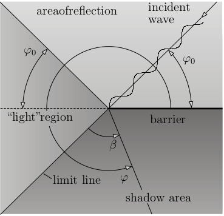

 # Diffraction App

Programmer: Benjamin Rüth, Supervisor: Alexander Greim

Here we visualize the effect of wave diffraction at a wall.


Different areas exist:

  
From[1]

For more information on theory see [1].

## Parameters for visualization

We want to be able to dynamically modify the following parameters in the visualization

* Angle of incidence
* Wavelenght

We want to explicitly visualize important input parameters and the regions of interest (visualized above).

## Approach for visualization

  

* Bokeh only supports 2D images, therefore, we do a contour plot of the wave (maybe red/blue for wave peaks/valleys?).

* We implemented 3D visualization of the waves (using https://demo.bokehplots.com/apps/surface3d and https://github.com/bokeh/bokeh/tree/master/examples/app/surface3d as template). We need to additionally **install** nodejs via ```conda install -c bokeh nodejs```

* Wavelength and angle is modified using sliders.

* Visualize areas of interest with shading of areas?

* If we want to use the 3D visualization of bokeh 

## ToDos

- [x] Translate Matlab code to python
- [x] Visualize waves using contour plot (sample code for contour plotting in https://github.com/BenjaminRueth/Visualization/tree/master/LagrangeApp)
- [x] Also visualized with 3d plot (consider https://demo.bokehplots.com/apps/surface3d as template)
- [x] add widgets for interaction
- [x] explicitly visualize wavefront, wavelength and angle of incidence
- [x] show light, shadow and reflection region
- [x] add value picker (on click)
- [x] two different resolutions for contour and surface plot
- [ ] explain app on website
- [ ] try to increase performance (maybe try different machine as client/server)

## Further Ideas

* one of the first questions, I asked myself in the video: Where does the wave actually originate? Explicitly visualize origin of wave and angle of incidence in plot!
* Also show means for elimination of noise?

## Resources

[1] Technische Universität München, Lecture Script, Technical Acoustics II, Winter Term 2016/2017, p.45-69
