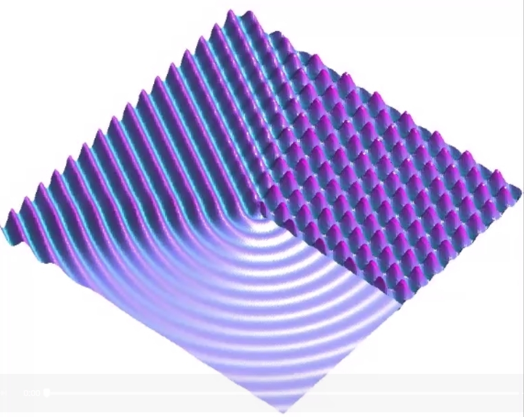

# Diffraction App

Programmer: Benjamin Rüth, Supervisor: Alexander Greim

Here we visualize the effect of wave diffraction at a wall.

## Parameters for visualization

We want to be able to dynamically modify the following parameters in the visualization

* Angle of incidence
* Wavelenght

## Approach for visualization

* Bokeh only supports 2D images, therefore, we do a contour plot of the wave (maybe red/blue for wave peaks/valleys?).

* Wavelength and angle is modified using sliders.
