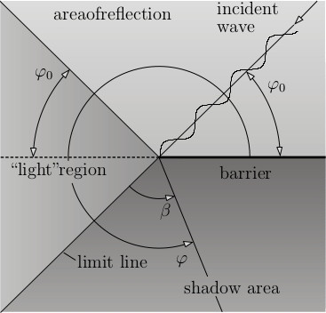
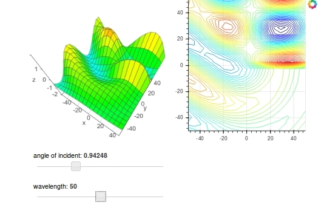

 # Diffraction App

Programmer: Benjamin Rüth, Supervisor: Alexander Greim

Here we visualize the effect of wave diffraction at a wall.


Different areas exist:

  
From[1]

For more information on theory see [1].

## Parameters for visualization

We want to be able to dynamically modify the following parameters in the visualization

* Angle of incidence
* Wavelenght

We want to explicitly visualize important input parameters and the regions of interest (visualized above).

## Approach for visualization

  

* We use a 2D contour plot for visualization of wave parameters and characteristic areas.

* We implemented 3D visualization of the waves (using https://demo.bokehplots.com/apps/surface3d and https://github.com/bokeh/bokeh/tree/master/examples/app/surface3d as template) for better impression of the waves. We need to additionally **install** nodejs via ```conda install -c bokeh nodejs```

* Wavelength and angle is modified using sliders.

* The noise at a certain position can be sampled by clicking into the contour plot.

## ToDos

- [x] Translate Matlab code to python
- [x] Visualize waves using contour plot (sample code for contour plotting in https://github.com/BenjaminRueth/Visualization/tree/master/LagrangeApp)
- [x] Also visualized with 3d plot (consider https://demo.bokehplots.com/apps/surface3d as template)
- [x] add widgets for interaction
- [x] explicitly visualize wavefront, wavelength and angle of incidence
- [x] show light, shadow and reflection region
- [x] add value picker (on click)
- [x] two different resolutions for contour and surface plot
- [x] explain app on website
- [ ] Add proper formula for computation of dB from amplitude. Currently we just probe the amplitude.
- [x] try to increase performance
- [ ] Remove artifacts in contour lines (currently we plot the lines with many line segments with only two vertices. This leads to disconnected lines with tiny gaps.)

## Performance Improvements

We are now using vtk for the computation of contour lines. ```conda install vtk```
For profiling run ```kernprof -l -v profiling.py``` and add ```@profile``` decorator at the functions that have to be profiled.
With those improvements we can run the app with 25Hz on a decent machine. Please also note that a high framerate not only puts strain onto the server, but also onto the client! Clients that are not powerful enough might suffer under the high framerate.

## Further Ideas

* Also show means for elimination of noise?

## Inspiration

* 3d surface implementation based on https://github.com/bokeh/bokeh/tree/master/examples/app/surface3d
* contour plot from https://github.com/BenjaminRueth/Visualization/blob/master/my_bokeh_utils.py

## Resources

[1] Technische Universität München, Lecture Script, Technical Acoustics II, Winter Term 2016/2017, p.45-69
